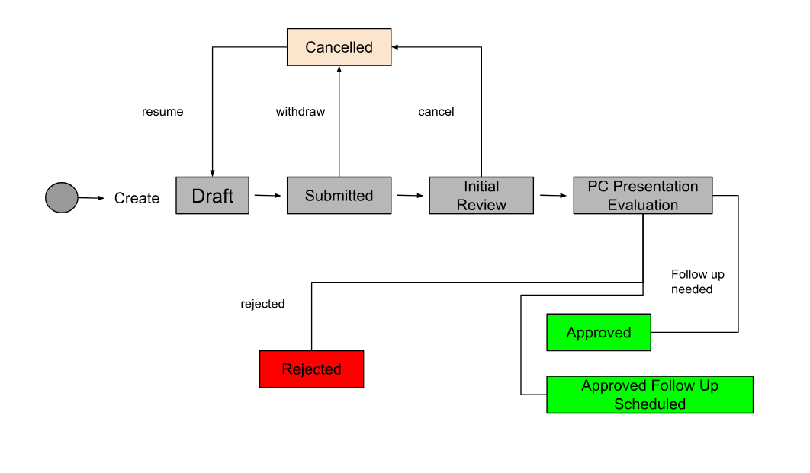

# New Review Evaluation Process JIRA Workflow

## Overview
This document outlines the JIRA Project and Workflow used by the New Functionality Product Council Evaluation Process.

### JIRA Project information
* The project where New Functionality Product Council Evaluation Process submissions should be created is called [Product Council Requests](https://issues.folio.org/projects/PCR).
* The only available issue type and one that should be used for submissions is "Task".

## JIRA Workflow

**DRAFT** Initial status for newly created submissions.

**SUBMITTED** Once the submission is ready for the PC review, the submitter transitions the issue to this state.

**INITIAL REVIEW** Once the submission is reviewed by the PC and an evaluation group is formed, the PC indicates this by transitioning the issue to this state.

**CANCELLED** If the submitter decides to withdraw the submission (alone or together with the evalation group), he/she transitions the issue to this state.
The submission may be resubmitted at a later time.

**PC PRESENTATION EVALUATION** Once the initial evaluation is complete, the evalution group communicates schedules a time for the submitters to present at a PC meeting and transitions the issue to this state.

**APPROVED** Once the evalution results are reviewed by the PC and the submission is approved, the PC transtions the issue to this state.

**APPROVED FOLLOW UP SCHEDULED** Once the evalution results are reviewed by the PC, the submission is approved, and a follow up meeting is scheduled with the PC, the PC transtions the issue to this state.

**REJECTED** Once the evalution results are reviewed by the PC and the submission is rejected, the PC transtions the issue to this state. The submitter may resubmit the submission once the failed criteria are addressed.
